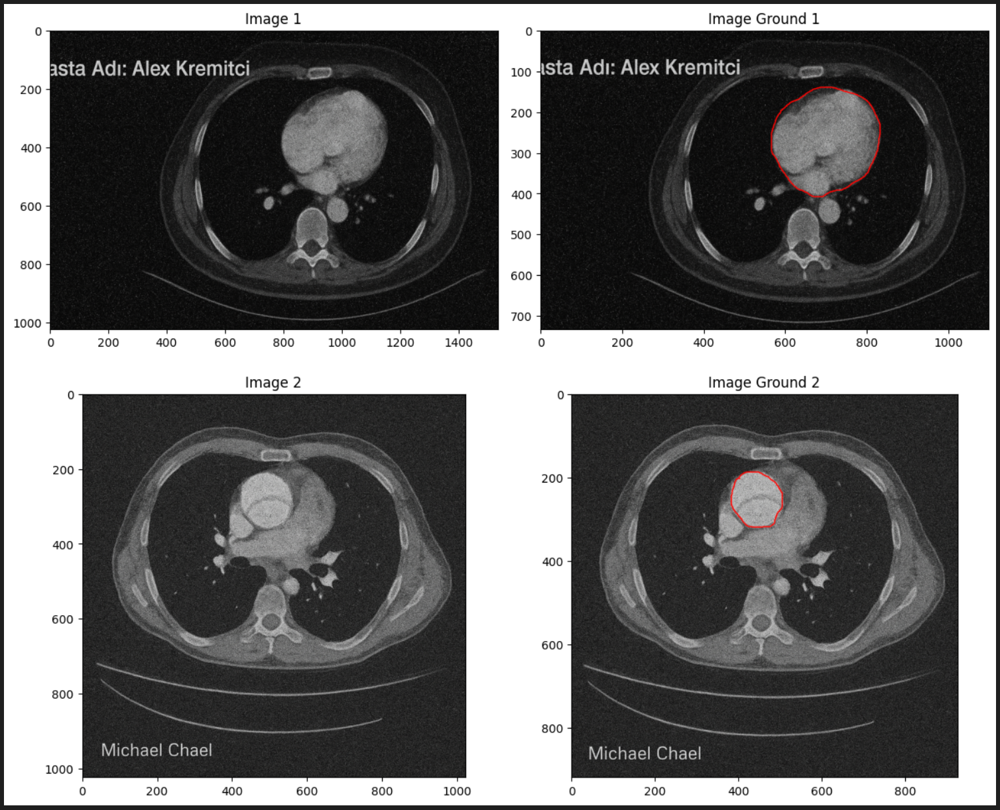
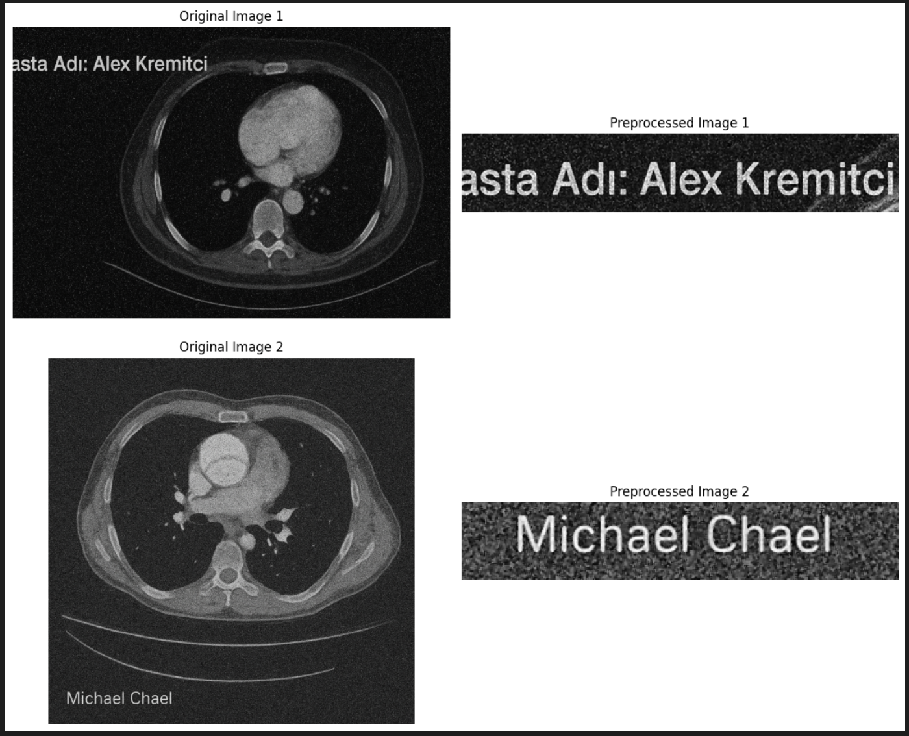
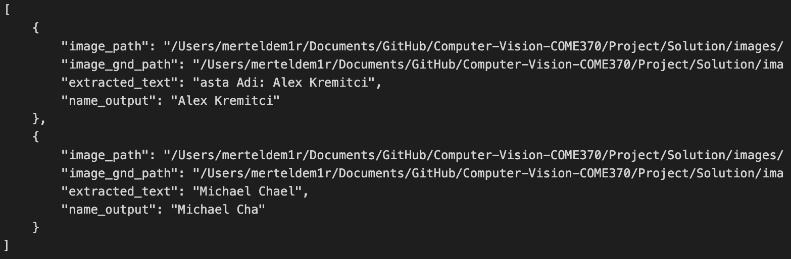
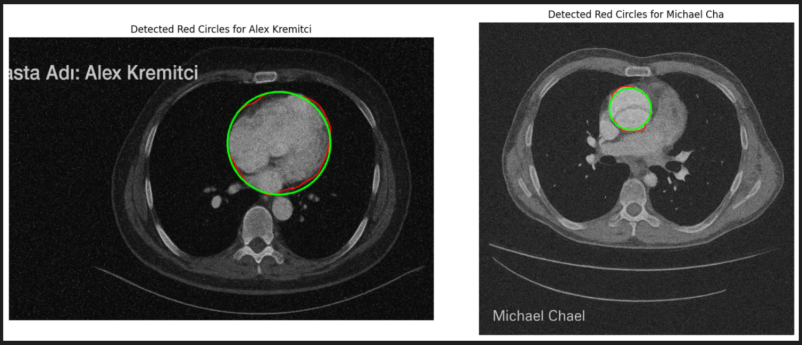

## Computer Vision Med Extractor

Project for **Computer Visiion - COME370** class.

### Project Overview

This project implements an automated image processing pipeline for extracting and organizing medical imaging data. The system detects regions of interest (ROI) in medical images, identifies patient names using OCR and Named Entity Recognition (NER), and organizes extracted data into patient-specific directories.

### Key Features

- **Text Extraction**: Extracts text from images using Tesseract OCR with preprocessing
- **Named Entity Recognition**: Identifies patient names from extracted text via OCR + using Hugging Face BERT-base-NER
- **Red Region Detection**: Locates and identifies marked regions (red circles) in ground truth images using HSV color detection
- **Automated Organization**: Creates patient folders and saves cropped circular regions automatically

### Project Structure

```
CTVision-Med-Extractor/
│── Directives/
│      └── Explanation.txt         # Project requirements and specifications
|── Solution/
│   ├── requirements.txt           # Python dependencies
│   ├── solution.ipynb             # Main implementation notebook
│   ├── images/                    # Input medical images
│   │   ├── I1.png                 # First medical image
│   │   ├── I2.png                 # Second medical image
│   │   ├── I1_gnd.png             # Ground truth annotations for I1
│   │   └── I2_gnd.png             # Ground truth annotations for I2
│   └── patients/                  # Output directory (auto-generated)
│       ├── Alex_Kremitci/
│       │   └── img.png            # Extracted circular ROI
│       └── Michael_Cha/
│           └── img.png            # Extracted circular ROI
```

### Implementation Details

#### Step 1: Image Loading

- Reads medical images (I1, I2) and their ground truth versions
- Prepares images for processing and visualization

  

#### Step 2: Image Preprocessing

- **Grayscale Conversion**: Converts BGR images to grayscale
- **Cropping**: Extracts relevant regions (top-left for I1, bottom-left for I2)
- **Denoising**: Applies median blur to reduce noise
- **Contrast Enhancement**: Uses CLAHE (Contrast Limited Adaptive Histogram Equalization)

#### Step 3: Text Extraction

- Applies OCR to preprocessed images using Tesseract
- Extracts patient information from specific regions

  

#### Step 4: Named Entity Recognition (NER)

- **NER Model**: https://huggingface.co/dslim/bert-base-NER
- Uses BERT-base-NER model to identify patient names
- Sends extracted text to Hugging Face API
- Extracts structured entity information



#### Step 5: Region Detection & Extraction

- Detects red circles in ground truth images using HSV color space filtering
- Extracts bounding rectangles around detected circles
- Creates circular masks to isolate region of interest
- Saves cropped regions in patient-specific directories



### How to Run

#### 1. Install Dependencies

```bash
cd Project/Solution
pip3 install -r requirements.txt
```

#### 2. Set Up Hugging Face API Token

Create a `.env` file in the `Solution/` directory:

```
HF_TOKEN=<api_token_here>
```

Get your token from: https://huggingface.co/settings/tokens
